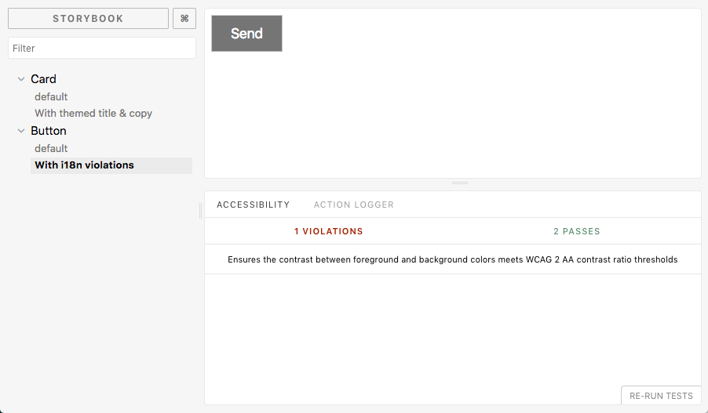

# Realib 📚

Boilerplate for creating React component libraries. Built with [rollup](https://github.com/rollup/rollup) and includes [storybook](https://github.com/storybooks/storybook) and [emotion](https://github.com/emotion-js/emotion).

## Getting Started

1. `git clone --depth=1 https://github.com/madeagency/realib.git`
2. `cd realib`
3. `npm install`
4. `npm run dev` to build the library and watch for changes or `npm run build` to build for production

## Authors

* **Francois** - *Initial work* - [fjlaubscher](https://github.com/fjlaubscher)
* **Ross** - *Initial work* - [rocbear](https://github.com/rocbear)

See also the list of [contributors](https://github.com/madeagency/realib/graphs/contributors) who participated in this project.

License
-------

Wobblifier is © 2018 MADE Code PTY Ltd.
It is free software, and may be redistributed under the terms specified in the [LICENSE] file.

[LICENSE]: LICENSE

Maintained by
----------------

Realib was created and is maintained MADE Agency PTY Ltd.
The names and logos for MADE Code are trademarks of MADE Code PTY Ltd.

We love open source software. See our [Github Profile](https://github.com/madeagency) for more.

We're always looking for talented people who love programming. [Get in touch] with us.

[Get in touch]: https://www.madecode.co.za?utm_source=github
